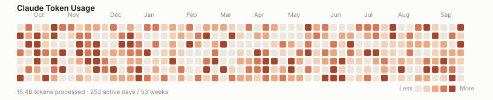

# TokenHeatMap

[](./LICENSE)

A GitHub-contributions-style heatmap of your Claude token usage — generated
locally from your own Claude Code logs, embeddable in READMEs and portfolios.



*(synthetic example data — install the skill to generate your own)*

## Status

**Phase 1: Claude Code only.** Data comes entirely from your local
`~/.claude/projects` session logs — nothing is sent anywhere. Support for
other agents (Codex, Copilot, etc.) and any hosted/always-live badge are
future phases, not implemented yet.

## What it is

A **Claude Code skill** (not an app or a server) that:

1. Reads your local Claude Code session transcripts.
2. Aggregates tokens processed per day.
3. Renders a single, self-contained SVG calendar heatmap — light/dark aware —
   that you commit to a repo and embed like any other image.

## Install

Copy the skill into your own Claude Code skills directory:

```bash
git clone https://github.com/SPARSH1608/TokenHeatMap.git
cp -r TokenHeatMap/skills/token-heatmap ~/.claude/skills/token-heatmap
```

(On Windows, copy `skills\token-heatmap` into `%USERPROFILE%\.claude\skills\`.)

Restart Claude Code (or start a new session) so it picks up the new skill.

## Use

From inside the repo you want the badge in, ask Claude:

> generate my token heatmap

Claude Code will invoke the `token-heatmap` skill, which:

- Writes `token-heatmap-data.json` (your aggregated per-day usage — safe to
  commit, or gitignore it if you'd rather keep raw numbers private).
- Writes `token-heatmap.svg` (the rendered heatmap).

Or run the scripts directly, no Claude session needed. Run them from the
repo you want the badge in, pointing at wherever you installed the skill
(macOS/Linux shown; on Windows use `%USERPROFILE%\.claude\skills\token-heatmap\scripts\...`):

```bash
python ~/.claude/skills/token-heatmap/scripts/collect_usage.py --out token-heatmap-data.json
python ~/.claude/skills/token-heatmap/scripts/render_svg.py --data token-heatmap-data.json --out token-heatmap.svg
```

## Embed it

In the same repo:

```markdown

```

From a different repo (e.g. a dedicated stats/profile repo), reference the
raw file:

```markdown

```

Works the same way in a portfolio site — it's a plain `` pointing at an
`.svg` file.

## Keeping it up to date

By default, generating the heatmap doesn't auto-commit or auto-push — you
review the diff and commit yourself.

If you want it to **update automatically every day**, run the setup script
once. It registers a local scheduled task (Windows Task Scheduler, or cron on
macOS/Linux) that collects usage, re-renders the SVG, and commits + pushes it
— skipping the commit entirely on days with no change:

```bash
python ~/.claude/skills/token-heatmap/scripts/setup_autoupdate.py --repo-dir /path/to/your/repo --time 06:00
```

This pushes to your git remote unattended, daily, until you remove it. Two
things to check first:

- `git push` already works non-interactively from this machine for that repo
  (cached credentials or an SSH agent with no passphrase prompt) — otherwise
  the scheduled run just fails silently every day.
- You're comfortable with an unattended process pushing commits on a
  schedule. Remove it any time with `--uninstall` (same command, plus that
  flag), or delete the generated wrapper script
  (`.token-heatmap-autoupdate.sh`/`.bat` in your repo) and its scheduled
  task/cron entry directly.

See [skills/token-heatmap/SKILL.md](./skills/token-heatmap/SKILL.md) for the
full details and safety notes.

## How the numbers work

Each day's token count sums `input + output + cache_creation + cache_read`
tokens across every assistant turn logged that day — i.e. total tokens
processed, not just what you typed or read. Cache reads dominate on long
sessions, which is why daily totals can look large; that's real usage/API
activity, not a bug.

## Project layout

```
skills/token-heatmap/
  SKILL.md                      - the installable skill definition
  scripts/collect_usage.py      - aggregates local logs -> usage JSON
  scripts/render_svg.py         - renders usage JSON -> SVG heatmap
  scripts/setup_autoupdate.py   - registers/removes the daily auto-update task
  examples/                     - synthetic sample data + rendered example
```

## Roadmap

- [x] Phase 1 — Claude Code, local logs, static SVG
- [ ] Phase 2 — other agents (Codex, Copilot, ...)
- [ ] Phase 3 — optional hosted badge for always-live embeds without local scheduling

## Contributing

Issues and PRs welcome — this is early and Phase 1-scoped on purpose, so
"add agent X" or "add metric Y" suggestions are useful even before there's
code behind them.

## License

[MIT](./LICENSE)
